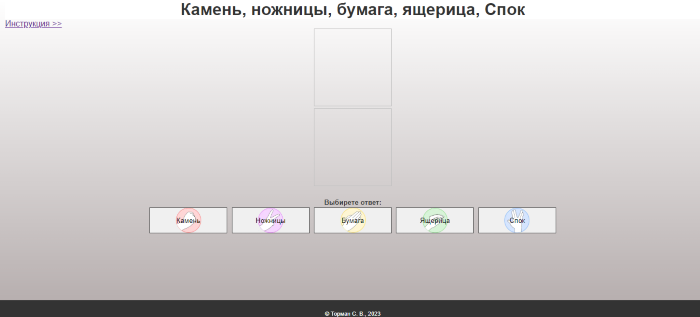
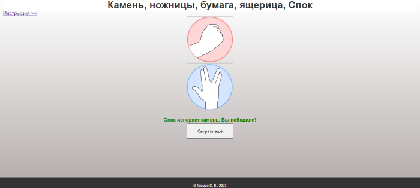

# Rock-Scissors-Paper-Lizard-Spock

## Камень, ножницы, бумага, ящерица, Спок

 Эта версия игры была придумана Сэмом Кассом. В ней к трем обычным жестам добавляются два: "Спок" – вулканский салют из "Стар Трека" и "ящерица" – пальцы, сложенные в виде мордочки.

## Инструкция игры

## Снимки экрана

 [Ссылка на демо](https://stanislav0305.github.io/Rock-Scissors-Paper-Lizard-Spock/)

## Описание Node.js-проекта
- В качестве рабочего инструмента использовался Visual Studio Code
- В качестве основного языка программирования использовался **TypeSctipt**
- А также использовался **HTML**, **SASS** и **JavaScript**

## Описание окружения для сборки проекта
Были использованы следующие инструменты:
- **node.js** - программная платформа
- **npm** - менеджер пакетов для **node.js**
- **Gulp** - инструмент для автоматизации задач

### Общая концепция
- `src/` - каталог для размещения рабочих файлов (html, scss, js, изображения)
- `docs/` - каталог для размещения готовой верстки
- `build/` - каталог для размещения готовой верстки для разработки и отладки, без минимизации и без name mangling'а.

Вся работа осуществляется в каталоге `src/`.

### Задачи Gulp
- Для полной сборки проекта запускаем команду `$ gulp --prod` или `$ npm run build-prod`
- Для полной сборки проекта с запуском отслеживания всех изменений `$ gulp` или `$ npm run start`

При запуске gulp задач с `--prod` параметром каталог назначения будет `docs/`, без него `build/`.

#### Все задачи Gulp в проекте:
- `start-info` - выводит название режима запуска в терминале:
    - **"--- PRODUCTION ---"** если был запуск с параметр `--prod`,
    - **"--- DEVELOPMENT ---"** если без параметра `--prod`;
- `clean` - очистка каталога назначения;
- `build-html` - выполняет:
    - сборка HTML 
    - и копирование в каталог назначения;
- `copy-images` - выполняет:
    - сжатие изображений, 
    - конвертацию изображений в формат WebP, 
    - и копирование изображений в каталог назначения;
- `build-css` - выполняет:
    - компиляцию SASS,
    - минификацию (если с параметр `--prod`),
    - добавление префиксов в CSS код (если с параметр `--prod`),
    - создание файла с исходными картами (если без параметр `--prod`),
    - и копирование в каталог назначения;
- `build-js` - выполняет:
    - компиляцию TS в JS, 
    - минификацию с name mangling'ом (если с параметр `--prod`), 
    - и копирование в каталог назначения;
- `start-server-livereload` - запускает локальный веб-сервер для livereload (запускается при отсутствии параметра `--prod`)
- `watch` - запускает отслеживание изменений в HTML, SASS, TS и картинках (запускается при отсутствии параметра `--prod`)

#### Были использованы следующие npm пакеты:
- Основные:
    - [@types/node](https://www.npmjs.com/package/@types/node) - в этом пакете описан node API. Это установит декларации Node API такие, как глобальные require/process/globals, стандартные модули fs/path/stream и прочее;
    - [yargs](https://www.npmjs.com/package/yargs) - помогает создавать интерактивные инструменты командной строки, анализируя аргументы и создавая элегантный пользовательский интерфейс.
    - [npm-run-script](https://www.npmjs.com/package/npm-run-scripts) - для запуска произвольных пакетов;
    - [gulp](https://www.npmjs.com/package/gulp) - потоковая система сборки проекта **Gulp**;
    - [gulp-if](https://www.npmjs.com/package/gulp-if) - для условного управления потоками **Gulp**;
    - [gulp-clean](https://www.npmjs.com/package/gulp-clean) - для удаления директорий (например, для очистки каталога назначения);
    - [gulp-changed](https://www.npmjs.com/package/gulp-changed) - для отслеживания изменений файлов;
    - [gulp-server-livereload](https://www.npmjs.com/package/gulp-server-livereload) - плагин **Gulp** для запуска локального веб-сервера с живой перезагрузкой;

- Для работы с файлами изображений:
    - [gulp-imagemin](https://www.npmjs.com/package/gulp-imagemin) - уменьшает объём изображения в форматах PNG, JPEG, GIF и SVG;
    - [gulp-webp](https://www.npmjs.com/package/gulp-webp) - плагин gulp для конвертации изображений в формат WebP;

- Для работы с HTML:
    - [gulp-file-include](https://www.npmjs.com/package/gulp-file-include) - для подключения файлов друг в друга, HTML include;
    - [gulp-webp-html-nosvg](https://www.npmjs.com/package/gulp-webp-html-nosvg) - плагин gulp для добавления кода html, как альтернативы для современных браузеров, с путями к изображению в формат WebP;

- Для работы с SASS и CSS:
    - [gulp-sourcemaps](https://www.npmjs.com/package/gulp-sourcemaps) - генерирует файлы с исходными картами;
    - [sass](https://www.npmjs.com/package/sass) - не только преобразует sass и scss файлы в css но и минифицырует их;
    - [gulp-sass](https://www.npmjs.com/package/gulp-sass) - плагин Sass для **Gulp**, не только преобразует sass и scss файлы в css но и минифицырует их;
    - [gulp-sass-glob](https://www.npmjs.com/package/gulp-sass-glob) - для возможности импорта несколько sass и scss файлов одной строкой с использованием шаблона пути, например @import 'vars/**/*.scss';
    - [gulp-autoprefixer](https://www.npmjs.com/package/gulp-autoprefixer) - позволяет не прописывать префиксы к свойствам каждый раз вручную, а добавлять их в автоматическом режиме;
    - [gulp-webp-css](https://www.npmjs.com/package/gulp-webp-css) - плагин gulp для добавления кода css, как альтернативы для современных браузеров, с путями к изображению в формат WebP;

- Для работы с TS и JS:
    - [typescript](https://www.npmjs.com/package/typescript) - транспилятор TypeScript;
    - [gulp-typescript]() - плагин gulp для управления рабочим процессом компиляции TypeScript;
    - [core-js](https://www.npmjs.com/package/core-js#i-highly-recommend-reading-this-so-whats-next) - модульная стандартная библиотека для JavaScript. Включает полифилы для ECMAScript до 2023 года: обещания, символы, коллекции, итераторы, типизированные массивы, многие другие функции;
    - [webpack-stream](https://www.npmjs.com/package/webpack-stream) - запускает webpack как поток для удобной интеграции с gulp;
    - Для webpack:
        - [babel-loader](https://www.npmjs.com/package/babel-loader) - этот пакет позволяет транспилировать файлы JavaScript с помощью Babel и веб-пакета;
        - [@babel/core](https://www.npmjs.com/package/@babel/core) - ядро компилятора Babel. Babel - это транспилятор, который, в основном, используется для преобразования конструкций, принятых в свежих версиях стандарта ECMAScript, в вид, понятный как современным, так и не самым новым браузерам;
        - [@babel/preset-env](https://www.npmjs.com/package/@babel/preset-env) - переписывает транспилированый JavaScript, чтобы финальный синтаксис работал в любом браузере, который указаны в конфигурации проекта;
        - [ts-loader](https://www.npmjs.com/package/ts-loader) - загрузчик TypeScript;

 [Ссылка на демо](https://stanislav0305.github.io/Rock-Scissors-Paper-Lizard-Spock/)